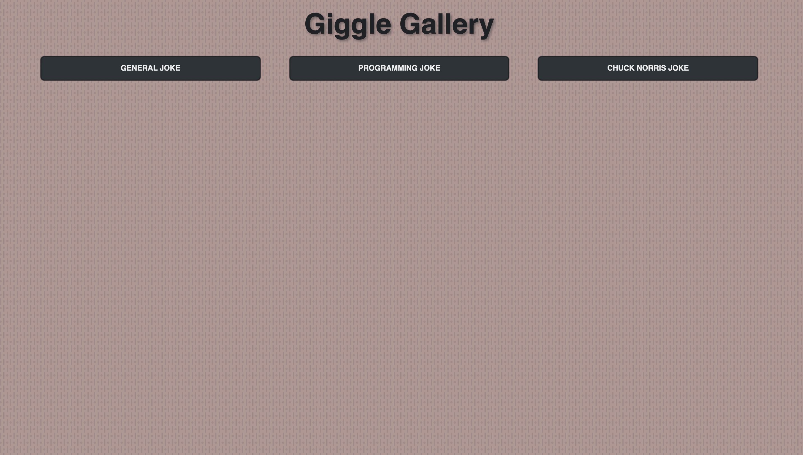
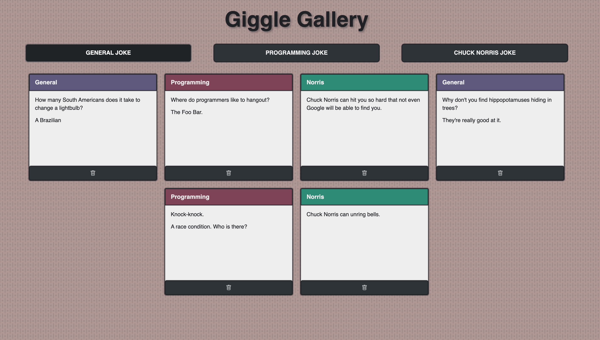
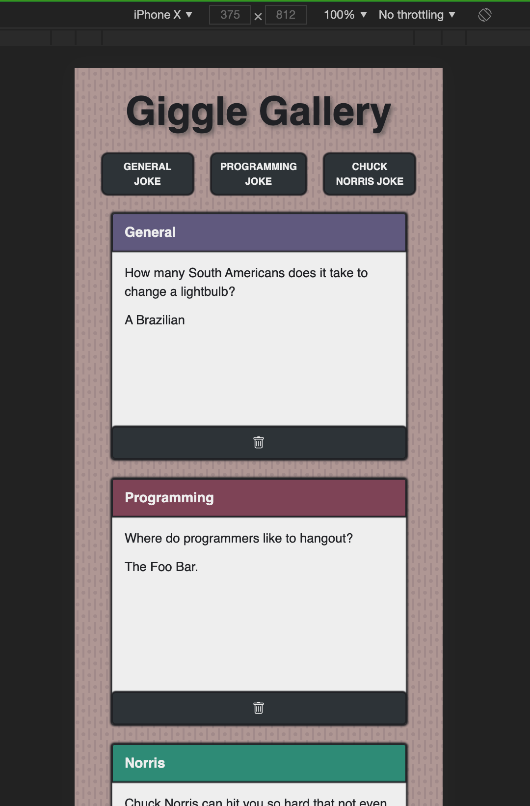

# [Giggle Gallery](http://giggle-gallery.surge.sh/)

## PSEUDOCODE

- design layout
- make 3 buttons (genBtn, norrisBtn, progBtn)
- container for cards with button to remove --> appended to children
- C.E.R for container and buttons
- event listeners
- API calls and console.log them
- put 'jokes' in card (store in variable
- function to handle appending car
- style...style...style

## LANGUAGES USED 
- HTML
- JAVASCRIPT
- CSS

## WIREFRAMING

### ORIGINAL CONCEPTS

### POSTMAN TESTS FOR VALUES

### UPDATED WIREFRAME

### LIVE SCREENSHOTS

### V2 SCREENSHOTS

## FUTURE ENHANCEMENTS

- More responsiveness changes
- reframing cards(picture frames)
- redo background (gold tone || venetian)
- make the h1 extend to the top of the page
- replace black with darkgray/old gold for visibility/aesthetic

## ATTRIBUTIONS

- CSS Background Animation: https://freefrontend.com/css-animated-backgrounds/
- KarlJoke API: https://karljoke.herokuapp.com/

## Versioning

- v1.0.0 (Nov 23, 2020)
  - `3938874` - `c690afd` Initial Launch
- v1.0.1 (Dec 2, 2020)
  - `6e4cfb4` & `7dca273` README updates 
- v1.2.0 (Feb 15, 2021)
  - `4451aea` & `d7d1824` Styling changes and README updates
- v1.3.0 (Apr 17, 2021)
  - `80c3fa4` - `b5f91d2` Styling changes and README updates
- v1.4.0 (Apr 24, 2021)
  - `537958b`, `70220e7`, & `894ef921` Styling changes
- v1.4.1 (May 1, 2021)
  - `d83f1e5` Added CSS images and README updates
- v2.0.0 (Dec 7, 2021)
  - `afe5691` Update API from Official-Joke-API to KarlJoke following permanent server shutdown
