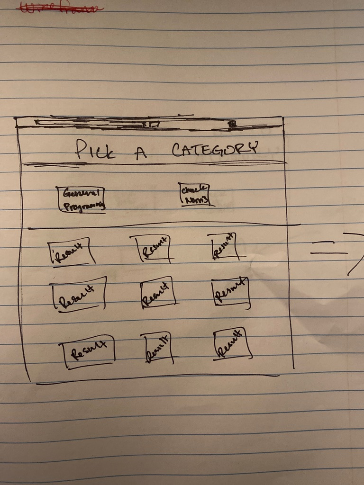
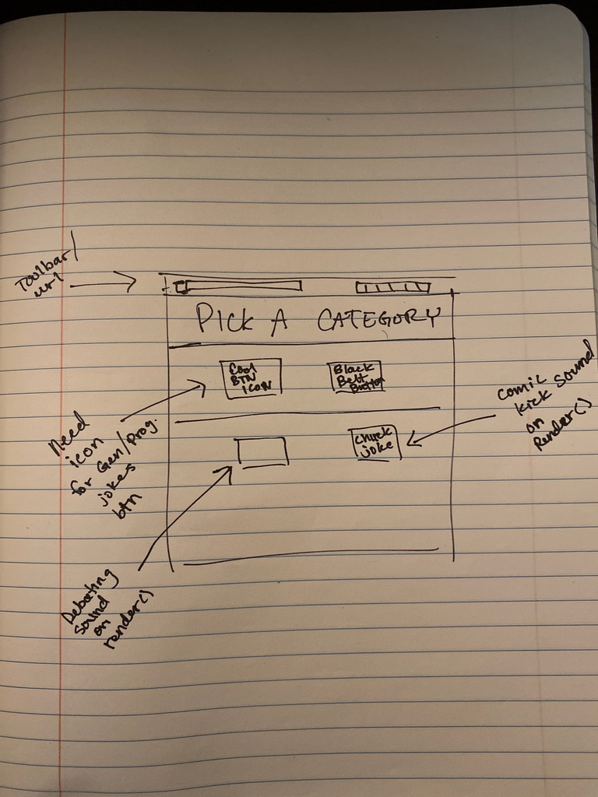

# UNIT-1-PROJECT(API)

## PSEUDOCODE

- design layout
- make 3 buttons (genBtn, norrisBtn, progBtn)
- container for cards with button to remove --> appended to children
- C.E.R for container and buttons
- event listeners
- API calls and console.log them
- put 'jokes' in card (store in variable
- function to handle appending car
- style...style...style

## WIREFRAMING

### ORIGINAL CONCEPTS

### POSTMAN TESTS FOR VALUES

### UPDATED WIREFRAME

### LIVE SCREENSHOTS

## FUTURE ENHANCEMENTS

- More responsiveness changes
- reframing cards(picture frames)
- redo background (gold tone || venetian)
- make the h1 extend to the top of the page
- replace black with darkgray/old gold for visibility/aesthetic

## ATTRIBUTIONS

I would like to sincerely thank the CSS Gods and the creators of these fantastic websites that made this project possible:
CSS Buttons: https://webdeasy.de/en/top-css-buttons-en/
CSS Background Animation: https://freefrontend.com/css-animated-backgrounds/